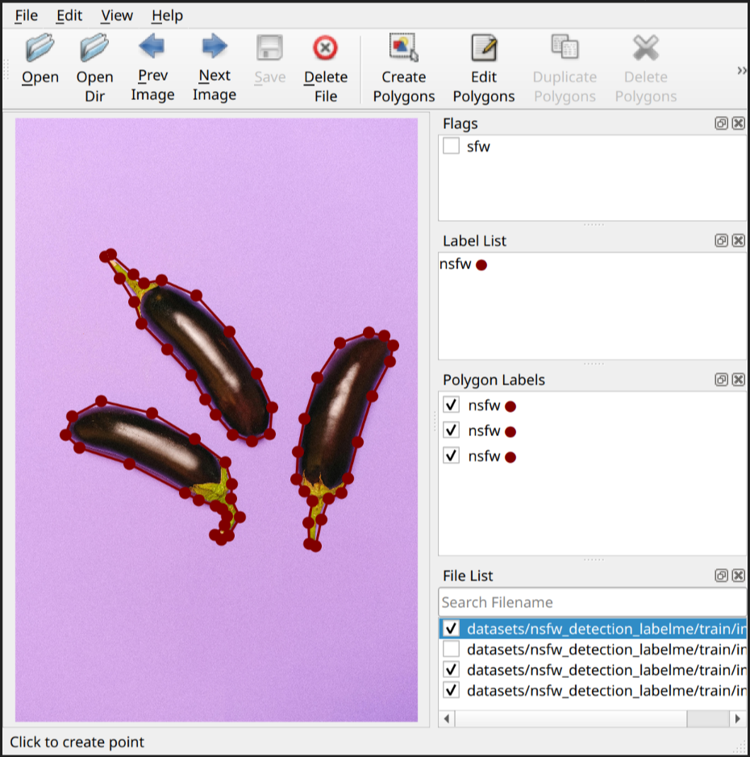
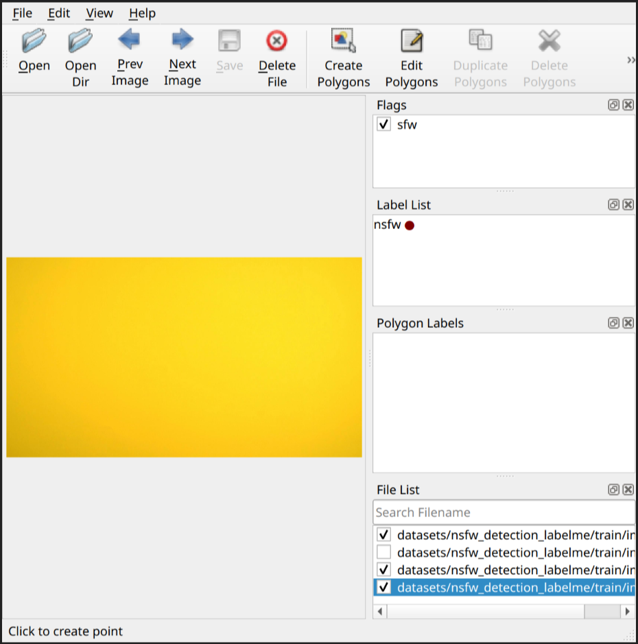
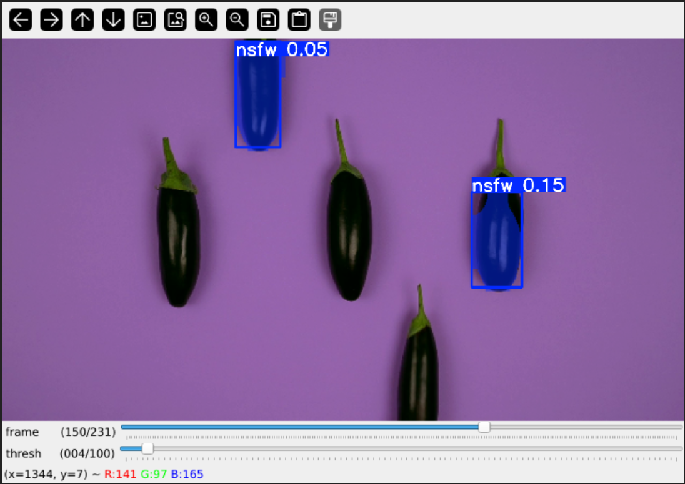

<h1 align="center">
  
  <br>
  Lada
</h1>

## Features
* Remove and recover pixelated content in adult videos
* Watch or export your videos via CLI or GUI

## Usage
### GUI
After opening a file you can either watch a restored version of the provided video in the app (make sure you've enabled the *Preview* toggle) or you can export it to a new file.

<picture>
  <source media="(prefers-color-scheme: dark)" srcset="assets/screenshot_gui_1_dark.png">
  <source media="(prefers-color-scheme: light)" srcset="assets/screenshot_gui_1_light.png">
  
</picture>
<picture>
  <source media="(prefers-color-scheme: dark)" srcset="assets/screenshot_gui_2_dark.png">
  <source media="(prefers-color-scheme: light)" srcset="assets/screenshot_gui_2_light.png">
  
</picture>

> [!TIP]
> If you've installed the flatpak then it should be available in your regular application launcher. You can also run it via `flatpak run io.github.ladaapp.lada`
> 
> Otherwise, if you've followed the Developer Installation section run the command `lada` to open the app (Make sure you are in the root directory of this project)

> [!NOTE]
> If you've installed Lada from Flathub and drag-and-drop doesn't work then your drag source (your file browser) probably does not support the [File Transfer Portal](https://flatpak.github.io/xdg-desktop-portal/docs/doc-org.freedesktop.portal.FileTransfer.html).
> You can fix/workaround this either by:
>  1) switching or updating your file browser to something that supports it
>  2) giving the app filesystem permissions (e.g. via [Flatseal](https://flathub.org/apps/com.github.tchx84.Flatseal) so it can read the file directly
>  3) use the 'Open' button / file dialog to select the file instead of drag-and-drop

You can find some additional settings in the left sidebar.

### CLI
You can also use the CLI to export the restored video
```shell
lada-cli --input <input video path> --output <output video path>
```


> [!TIP]
> If you've installed the app via Flathub then the command would look like this (instead of *host* permissions you could also use `--file-forwarding` option)
>  ```shell
>  flatpak run --filesystem=host --command=lada-cli io.github.ladaapp.lada --input <input video path> --output <output video path>
>  ```
> You can also set an alias in your favourite shell and use as the same shorter command as shown above
> ```shell
> alias lada-cli="flatpak run --filesystem=host --command=lada-cli io.github.ladaapp.lada"
>  ```

> [!TIP]
> Lada will write the restored video first to a temporary file before it is being combined with the audio stream from the original file and written to the selected destination.
> Default location is `/tmp`. You can overwrite it by setting the `TMPDIR` environment variable.
> On flatpak you can either pass `--env=TMPDIR=/my/custom/tempdir` to the run command or you can use Flatseal to overwrite this permanently.

You can find out more about additional options by using the `--help` argument.

## Status
Don't expect this to work perfectly, some scenes can be pretty good and close to the real thing. Other scenes can be rather meh and show worse artifacts than the original mosaics.

You'll need a Nvidia (CUDA) GPU and some patience to run the app.
If your GPU is not fast enough to watch the video in real-time you'll have to export it first and watch it later with your favorite media player.
If your card has at least 4-6GB of VRAM then it should work out of the box.

The CPU is used for re-encoding the restored video so shouldn't be too slow either. The app uses a lot of RAM for buffering to increase throughput.
For 1080p content you should be fine with 6-8GB RAM, 4K will need more. This could be lowered by fine-tuning some knowbs in the code if you're that low on RAM.

Technically running the app on your CPU is also supported where *supported* is defined as: It will not crash but processing will be so slow you wish you haven't given it a try.

Here are some speed performance numbers using Lada v0.4.0 on my available hardware to give you an idea what to expect:

| Video name | Video description                                                                                    | Video<br>duration / resolution / FPS | Lada<br>runtime / FPS<br>Nvidia RTX 3050<br>(*Laptop GPU*) | Lada<br>runtime / FPS<br>Nvidia RTX 3090<br>(Desktop GPU) |
|------------|------------------------------------------------------------------------------------------------------|--------------------------------------|------------------------------------------------------------|-----------------------------------------------------------|
| vid1       | multiple mosaic regions present on all frames                                                        | 1m30s / 10920x1080 / 30 FPS          | 15m33s / 2.8 FPS                                           | 1m41s / 26 FPS                                            |
| vid2       | single mosaic region present on all frames                                                           | 3m0s / 1920x1080 / 30 FPS            | 20m36s / 4.3 FPS                                           | 2m18s / 39 FPS                                            |
| vid3       | half of the video doesn't have any mosaics present,<br>the other half mostly single mosaic per frame | 41m16s / 852x480 / 30 FPS            | 3h20m57s / 6.1 FPS                                         | 13m10s / 94 FPS                                           |


As you can see, Realtime playback for Nvidia RTX 3050 (Laptop GPU) is currently out-of-reach but Preview functionality can still be used to skip through a video (with some loading/buffering) to see what quality to expect from an export.

It may or may not work on Windows and Mac and other GPUs. You'll have to try to follow Developer Installation below and see how far you get.
Patches / reports welcome if you are able to make it run on other systems.

## Installation
On Linux the easiest way to install the app is to get it from Flathub.

<a href='https://flathub.org/apps/details/io.github.ladaapp.lada'></a>

> [!CAUTION]
> The flatpak works only with x86_64 CPUs with Nvidia/CUDA GPUs (CPU also, but read the notes in [Status](#Status) first)

If you don't want to use flatpak, have other hardware specs than what the flatpak is built for or if you're not using Linux you'd need to follow the [Developer installation](#Developer-Installation) steps for now.
Contributions welcome if someone is able to package the app for other systems.

## Models
The project comes with a `generic` mosaic removal / video restoration model that was trained on a diverse set of scenes and is used by default.
There is also a `bj_pov` model which was trained only on such specific clips and may show better results than the generic model but therefore is not as versatile (Didn't notice much of a difference but YMMV).

> [!TIP]
> For folks currently using [DeepMosaics](https://github.com/HypoX64/DeepMosaics): You can use their `clean_youknow_video.pth` model in Lada if you prefer.
> Download it from their page, move it in `model_weights/3rd_party` directory and select in CLI/GUI. (you can't do this on the flatpak version currently)

You can select the model to use in the sidepanel or if using the CLI by passing the arguments for path and type of model.

> [!NOTE]
> There are also models for detection for both mosaiced/pixelated and non-obstructed NSFW sources which are used internally for pre-processing and model training.

## Developer Installation

### System dependencies

1) Install Python <= 3.12

2) [Install FFmpeg](https://ffmpeg.org/download.html)

3) [Install GStreamer](https://gstreamer.freedesktop.org/documentation/installing/index.html)

4) [Install GTK](https://www.gtk.org/docs/installations/)

### Python dependencies
This is a Python project so let's install our dependencies from PyPi:

1) Create a new virtual environment
    ```bash
    python -m venv .venv
    source .venv/bin/activate
    ```

2) [Install PyTorch](https://pytorch.org/get-started/locally)

3) [Install MMCV](https://mmcv.readthedocs.io/en/latest/get_started/installation.html)
   > [!TIP]
   > You can install it either with their own installer `mim` or via `pip`.
   > I've had issues installing via `mim` but `pip` worked. Just make sure to select the correct command depending on your system and PyTorch installation 

   > At the time of writing MMCV does only ship binary wheels for Torch up to 2.4.x. 
   > You'll have to compile MMCV yourself following their documentation (not a big deal) or downgrade `torch`/`torchvision` to 2.4.x.

4) Install this project together with the remaining dependencies
    ```bash
    python -m pip install -e '.[basicvsrpp,gui]'
    ````
    These extras are enough to run the model, GUI and CLI. If you want to train the model(s) or work on the dataset(s) install additional extras `training,dataset-creation`.


5) Apply patches

    In order to fix resume training of the mosaic restoration model apply the following patch not currently present in latest upstream package(`mmengine`/`0.10.5`):
    ```bash
    patch -u ./.venv/lib/python3.12/site-packages/mmengine/runner/loops.py -i patches/adjust_mmengine_resume_dataloader.patch
    patch -u ./.venv/lib/python3.12/site-packages/ultralytics/models/yolo/segment/predict.py patches/increase_mms_time_limit.patch
    ```

### Install models
Download the models from the GitHub Releases page into the `model_weights` directory. The following commands do just that
```shell
wget -P model_weights/ 'https://github.com/ladaapp/lada/releases/download/v0.2.0/lada_mosaic_detection_model_v2.pt'
wget -P model_weights/ 'https://github.com/ladaapp/lada/releases/download/v0.2.1/lada_mosaic_restoration_model_generic_v1.1.pth'
wget -P model_weights/ 'https://github.com/ladaapp/lada/releases/download/v0.1.0/lada_mosaic_restoration_model_bj_pov.pth'
```

To train the models you'll also need these files
```shell
wget -P model_weights/3rd_party/ 'https://download.openmmlab.com/mmediting/restorers/basicvsr/spynet_20210409-c6c1bd09.pth'
wget -P model_weights/3rd_party/ 'https://download.pytorch.org/models/vgg19-dcbb9e9d.pth'
wget -P model_weights/3rd_party/ 'https://github.com/QualityAssessment/DOVER/releases/download/v0.1.0/DOVER.pth'
wget -P model_weights/ 'https://github.com/ladaapp/lada/releases/download/v0.1.0/lada_nsfw_detection_model.pt'
```

Now you should be able to run the GUI via `lada` or the CLI via `lada-cli`.

## Training
The app consists of two models: mosaic detection and mosaic restoration.
The goal of the mosaic detection model is to detect for each frame of the video if and where pixelated/mosaic regions exist.
It will try to crop and cut small clips and hand them over to the mosaic restoration model. This will try to recover what it can from those degraded frames and come up with a somewhat plausible replacement for those images.
These restored clip will replace the original content when they're reassembled with the original frames.
> There is also a NSFW detection model used only for dataset creation for the other two models.

The following sections describe how to train and create a dataset for each model.
If you're not interested in training specific models you can use the pretrained model weights from Lada where needed.

> [!NOTE]
> Lada models were trained using Python 3.12 / Torch 2.4.1-cuda-12.4 / MMCV 2.2.0 / Ultralytics 8.3.23 but I would suggest to use latest versions as described in the Developer Installation section.

> [!TIP]
> In some scripts OpenCV QT-based GUI features are using for debugging purposes. 
> OpenCV currently does not support wayland, you may want to force QT to use its X11 backend by setting the following environment variable
> `export QT_QPA_PLATFORM=xcb`

### Mosaic restoration model
Before we can train the model we'll need to create a dataset.
AFAIK, there are no publicly available datasets for such purpose and I'll not provide one either. But you can create your own dataset for training mosaic removal models this way:

```shell
python create_mosaic_removal_video_dataset.py --input <input dir> --output-root <output dir>
```
Here `<input dir>` should be a directory containing your source material (adult video files without mosaics).

The script will detect regions of NSFW material and cut and crop short clips to be used for mosaic restoration training.

The script doesn't necessarily need to be called with additional options, but you should check them out (`--help`) and play with it to understand what's going on before running this on a lot of data.

For example:
You can optimize worker and memory limits according to your machine. You can also run the script in parallel on different subset of data using different GPUs.
There are options to create mosaic clips as well which can be useful to inspect generated mosaic clips.

Try it on a small subset of your data first to see how it works.
Also, check out the code `MosaicVideoDataset` in `mosaic_video_dataset.py` as well as the dataloader/dataset settings in `mosaic_restoration_generic_stage{1,2}.py` in the `config` dir to understand how this generated dataset will be used in training.

For your final dataset you don't need to save mosaic videos as mosaics are created on-the-fly by `MosaicVideoDataset`.

The script uses the NSFW detection model. It's not perfectly accurate, and you'll have to validate and remove false-positive clips manually after it ran.
You also want to exclude very low quality video clips by some `jq` magic to filter on the `video_quality.overall` attribute in the created metadata json files. `0.1` seems to be a good value.

Now, with a dataset at hand we're ready to train a model.

Training the mosaic restoration model is done in two steps. You can find training scripts in the project root directory and related configuration files in the `config` directory.
The first stage consists of training a BasicVSR++ model only with pixel loss (you'll need to [create a dataset](#Datasets)  first)
```shell
python train_basicvsrpp.py configs/basicvsrpp/mosaic_restoration_generic_stage1.py
```
> You can continue an interrupted run by adding `--resume` to the command line.

Before we can continue training stage2 you'll have to convert the trained weights into the GAN-compatible model with the following script
```shell
python lada/basicvsrpp/convert_weights_to_basicvsrpp_gan.py
```
Now we can continue training with additional GAN and perceptual losses.
```shell
python train_basicvsrpp.py configs/basicvsrpp/mosaic_restoration_generic_stage2.py --load-from experiments/basicvsrpp/mosaic_restoration_generic_stage1/iter_10000_converted.pth
```

If you're happy with the model you can export it for inference and remove the discriminator model via:
```shell
python lada/basicvsrpp/export_gan_inference_model_weights.py
```

Note that the model is implemented in the MMagic / MMEngine framework. If you need to adjust model or training parameters you can do that by adjusting
the files in the `config` directory.

I'd recommend to read through [MMengine documentation](https://mmengine.readthedocs.io/en/latest/) first if you're not familiar with that library.


### NSFW detection model
The purpose of this dataset is to train an image segmentation model which we can feed video frames to detect if and where NSFW regions exist in the image (binary segmentation task).
This model is then only used in the mosaic restoration and mosaic detection dataset creation scripts.
Creating this dataset is a labor-intensive process, you'll have to hand-label each image and draw segmentation masks around all NSFW regions visible in each image.

I used and recommend the tool [labelme](https://github.com/wkentaro/labelme) for this task.

Setup and use another virtual environment to avoid dependency conflicts with Lada dependencies when installing labelme
```shell
python -m venv .venv_labelme
source .venv_labelme/bin/activate
pip install labelme
```

Create training and validation directories for your NSFW detection dataset and fill it with diverse set of NSFW video frames and images
```shell
mkdir -p datasets/nsfw_detection_labelme/{train,val}
```

Then start the tool with this command

```shell
labelme --flags sfw --labels nsfw --nodata --autosave datasets/nsfw_detection_labelme/train
```

I'd suggest to keep the masks relatively tight around each object. In practise mosaics are often not very precise and also cover a good amount of SFW content around NSFW parts.
We'll randomly extend those masks automatically when working on mosaic detection or mosaic restoration so we should label them relatively precisely in this step.

In *labelme* use the *Draw Polygon* tool to label NSFW regions in the image.



You should also add some images without any visible NSFW content. For those, create a *SFW* label and no Polygons.



Then continue this process with a couple more images.

Now let's train the model

> [!NOTE]
> To continue switch back to lada virtual environment `.venv`. Use the `.venv_labelme` only when annotating files in labelme.

We're training a YOLO v11 segmentation model (`yolo11m-seg`).
YOLO or rather the library we're using to train it (*ultralytics*) does not support labelme format so we'll have to convert into the format they can understand:
```shell
mkdir -p datasets/nsfw_detection/{train,val}/{images,labels}
python lada/yolo/convert-labelme-to-yolo.py --dir-in datasets/nsfw_detection_labelme/train --dir-out-images datasets/nsfw_detection/train/images --dir-out-labels datasets/nsfw_detection/train/labels
python lada/yolo/convert-labelme-to-yolo.py --dir-in datasets/nsfw_detection_labelme/val --dir-out-images datasets/nsfw_detection/val/images --dir-out-labels datasets/nsfw_detection/val/labels
```

With that step out of the way we're now ready to start the training process. Simply run
```shell
python lada/yolo/train-yolo-nsfw-detection.py
```

> [!TIP]
> Under the hood, `ultralytics` package is used to train the model. You can read their [documentation](https://docs.ultralytics.com/) for further details.


Once that is done test it on some real-world NSFW videos (not from the source material you've been training with) using the following script:
```shell
python lada/yolo/view-yolo.py --input <path to your nsfw file> --model-path experiments/yolo/segment/train_nsfw_detection_yolo11m/weights/best.pt --screenshot-dir datasets/nsfw_detection_labelme/train
```

This will open a very simple GUI where you can seek through the video frame-by-frame to check the detection result (masks and prediction confidence levels).
If you find frames with false-positives or other parts the model incorrectly classified hit the `S` key to take a screenshot and save the frame in the specified directory.



Then you can fire up labelme once more and annotate this file properly.

Repeat these steps to annotate, convert, train, validate a couple of times, and you have built yourself a NSFW detection model.

### Mosaic detection model
Purpose of the mosaic detection model is to detect if and where mosaic regions are in a given video frame. It's used as the first part of the restoration pipeline of Lada.
Assuming you have a directory of NSFW videos and a trained NSFW detection model (either the pretrained model weights from lada or you've trained your own version following above-mentioned procedure)
the creation of this dataset will be an automatic process.

You can create a dataset for mosaic detection using the following command:

```shell
mosaic_detection_dataset_source_material="datasets/mosaic_detection_raw"
mosaic_detection_dataset_tmp_dir="datasets/mosaic_detection_tmp"

python create_mosaic_detection_image_dataset.py --input-root "$mosaic_detection_dataset_source_material"  --output-root "$mosaic_detection_dataset_tmp_dir"
```

The script will run the NSFW detection model on the source material. For frames with NSFW content it will use the segmentation mask and the original video frame
to create a new image where the NSFW region is replaced with a mosaic / pixelize pattern. This image as well as the segmentation mask of the mosaic is then saved in the output root directory.

The script comes with some options you may want to check and adjust before you're running this on a huge dataset.

> [!TIP]
> You can re-use the source material used for mosaic restoration or NSFW detection dataset creation.


The mosaic detection model uses the same architecture as the NSFW detection model YOLO `yolo11m-seg`. Similarly to the steps above we need to convert the dataset first
to a format that the training library of YOLO *ultralytics* understands. For this we'll convert the binary mask images (PNG files) first to COCO format and then to YOLO format.

```shell
python lada/yolo/convert-mask-images-to-coco.py --images-dir "$mosaic_detection_dataset_tmp_dir/img" --masks-dir "$mosaic_detection_dataset_tmp_dir/mask" --output-file "$mosaic_detection_dataset_tmp_dir/coco.json"
python lada/yolo/convert-coco-to-yolo.py --coco-file "$mosaic_detection_dataset_tmp_dir/coco.json" --yolo-labels-dir "$mosaic_detection_dataset_tmp_dir/labels"
```

Now we just need to split it into a training and test set.

Now we just need to split it into a training and test set.
The following shell commands will do just that. You may want to adjust the variable `val_samples_count`.
It will randomly select items from the dataset up the given number and move it the validation directory `val`.
Everything else will land in the training set `train`.

```shell
mosaic_detection_dataset_dir="datasets/mosaic_detection"
val_samples_count=500

# extract $val_samples_count samples as validation dataset
mkdir -p "$mosaic_detection_dataset_dir"/{train,val} "$mosaic_detection_dataset_dir"/val/{labels,images}
find $mosaic_detection_dataset_tmp_dir/img -type f | sort -R | head -n $val_samples_count | while read img_path ; do 
    mask_path="$mosaic_detection_dataset_tmp_dir/labels/$(basename ${img_path%.jpg}.txt)"
    mv "$img_path" "$mosaic_detection_dataset_dir/val/images"
    mv "$mask_path" "$mosaic_detection_dataset_dir/val/labels"
done
# whats left will be used as training dataset
mv "$mosaic_detection_dataset_tmp_dir/img" "$mosaic_detection_dataset_dir/train/images"
mv "$mosaic_detection_dataset_tmp_dir/labels" "$mosaic_detection_dataset_dir/train/labels"

# delete tmp dataset
# rm -r $mosaic_detection_dataset_tmp_dir
```

Now we can train the model via
```shell
python lada/yolo/train-yolo-mosaic-detection.py
```

> [!TIP]
> Under the hood, `ultralytics` package is used to train the model. You can read their [documentation](https://docs.ultralytics.com/) for further details.

To check its performance you can use the `view-yolo.py` script as described in the training section of the NSFW detection model.


## Credits
This project builds on work done by these fantastic people

* [DeepMosaics](https://github.com/HypoX64/DeepMosaics): Used their code to create mosaic for dataset creation/training, you can also run their clean_youknow_video model in this app. They seem to be the only other open source project trying to solve this task I could find. Kudos to them!
* [BasicVSR++](https://ckkelvinchan.github.io/projects/BasicVSR++) / [MMagic](https://github.com/open-mmlab/mmagic): Used as base model for mosaic removal
* [YOLO/Ultralytics](https://github.com/ultralytics/ultralytics): Used as model to detect mosaic regions as well as non-mosaic regions for dataset creation
* [DOVER](https://github.com/VQAssessment/DOVER): Used to assess video quality of created clips during the dataset creation process to filter out low quality videos
* [Twitter Emoji](https://github.com/twitter/twemoji): Used eggplant emoji as base for the app icon (feel free to contribute a better logo)
* PyTorch, FFmpeg, GStreamer, GTK and [all other folks building our ecosystem](https://xkcd.com/2347/)


Previous iterations of the mosaic removal model used the following projects as a base

* [KAIR / rvrt](https://github.com/cszn/KAIR)
* [TecoGAN-PyTorch](https://github.com/skycrapers/TecoGAN-PyTorch)
