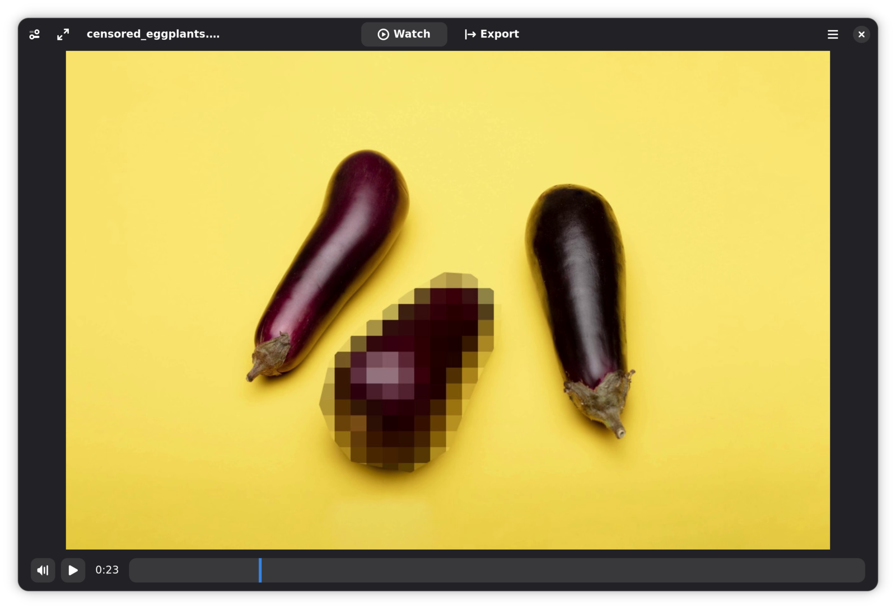
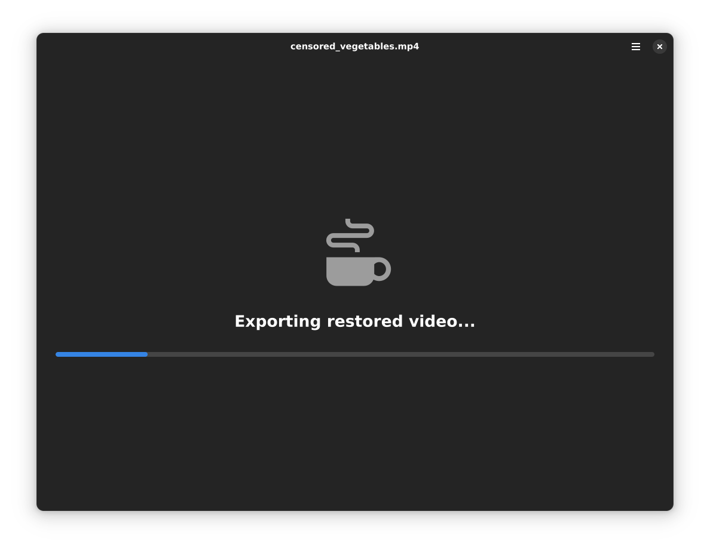
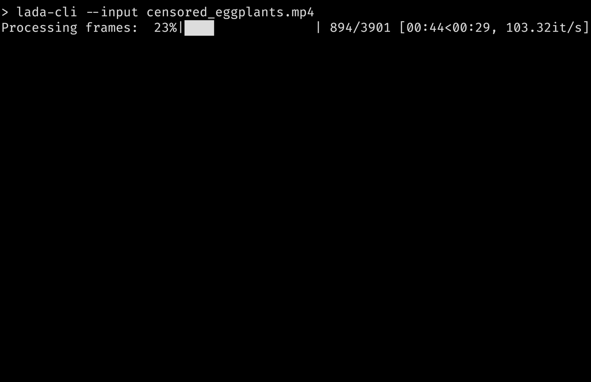

<h1 align="center">
  
  <br>
  Lada
</h1>

*Lada* is a tool designed to recover pixelated adult videos (JAV). It helps restore the visual quality of such content, making it more enjoyable to watch.

## Features

- **Recover Pixelated Videos**: Restore pixelated or mosaic scenes in adult videos.
- **Watch/Export Videos**: Use either the CLI or GUI to watch or export your restored videos.

## Usage

### GUI

After opening a file, you can either watch the restored version of the provided video within the app (make sure you've enabled the *Preview* toggle) or export it to a new file.

<picture>
  <source media="(prefers-color-scheme: dark)" srcset="assets/screenshot_gui_1_dark.png">
  <source media="(prefers-color-scheme: light)" srcset="assets/screenshot_gui_1_light.png">
  
</picture>
<picture>
  <source media="(prefers-color-scheme: dark)" srcset="assets/screenshot_gui_2_dark.png">
  <source media="(prefers-color-scheme: light)" srcset="assets/screenshot_gui_2_light.png">
  
</picture>

> [!TIP]
> If you've installed the flatpak then it should be available in your regular application launcher. You can also run it via `flatpak run io.github.ladaapp.lada`.
> 
> Otherwise, if you followed the Developer Installation section, use the command `lada` to open the app (ensure you are in the root directory of this project).

> [!NOTE]
> If you installed Lada from Flathub and drag-and-drop doesn't work, your file browser might not support [File Transfer Portal](https://flatpak.github.io/xdg-desktop-portal/docs/doc-org.freedesktop.portal.FileTransfer.html).
> You can fix this by:
>  1) Switching or updating your file browser to one that supports it.
>  2) Granting the app filesystem permissions (e.g., via [Flatseal](https://flathub.org/apps/com.github.tchx84.Flatseal) so it can read files directly).
>  3)  Using the 'Open' button to select the file instead of drag-and-drop.

Additional settings can be found in the left sidebar.

### CLI

You can also use the command-line interface (CLI) to export restored videos:

```shell
lada-cli --input <input video path> --output <output video path>
```


> [!TIP]
> If you've installed the app via Flathub then the command would look like this (instead of *host* permissions you could also use `--file-forwarding` option):
>  ```shell
>  flatpak run --filesystem=host --command=lada-cli io.github.ladaapp.lada --input <input video path> --output <output video path>
>  ```
> Alternatively, set an alias in your shell to simplify the command and match the non-flatpak version:
> ```shell
> alias lada-cli="flatpak run --filesystem=host --command=lada-cli io.github.ladaapp.lada"
>  ```

> [!TIP]
> If you installed via Docker, use:
>  ```shell
> docker run --rm --gpus all --mount type=bind,src=<path to input/output video dir>,dst=/mnt ladaapp/lada:latest --input /mnt/<input video file> --output /mnt/<output video file>
> ```

> [!TIP]
> Lada writes the restored video to a temporary file before combining it with the audio stream from the original file and saving it to the selected destination. The default location is `/tmp`.
> You can change this by setting the `TMPDIR` environment variable. On flatpak, you can pass `--env=TMPDIR=/my/custom/tempdir` or use Flatseal to set it permanently.

For more information about additional options, use the `--help` argument:

## Restoration options
The project comes with a generic mosaic removal model that was trained on a diverse set of scenes and is used by default.

> [!TIP]
> For folks currently using or interested in the mosaic restoration model from [DeepMosaics](https://github.com/HypoX64/DeepMosaics):
> It is integrated in Lada and you can use it via CLI or GUI if you prefer. As DeepMosaics is not maintained anymore it's also included in the Flatpak and Docker image of Lada so it's easier to use.

You can choose the model to use via the side panel, or when using the CLI by specifying the path and type of the model as arguments.

## Status
Don't expect this to work perfectly, some scenes can be pretty good and close to the real thing. Other scenes can be rather meh and show worse artifacts than the original mosaics.

You'll need a Nvidia (CUDA) GPU and some patience to run the app. If your card has at least 4-6GB of VRAM then it should work out of the box.

The CPU is used for encoding the restored video so shouldn't be too slow either (current version does not ship with GPU video encoders). You can adjust encoder options to your needs on the CLI.

The app also needs quite a bit of RAM for buffering to increase throughput. For 1080p content you should be fine with 6-8GB RAM, 4K will need a lot more.

If you want to use watch the restored video in the GUI preview mode in real-time you'll need a pretty beefy machine or you'll see the player pausing until next restored frames are computed.
GUI Preview mode will need less CPU resources as it will not have to encode the video but will use more additional RAM for buffering.

If your GPU is not fast enough to watch the video in real-time you'll have to export it first and watch it later with your favorite media player.

Technically running the app on your CPU is also supported where *supported* is defined as: It will not crash but processing will be so slow you wish you haven't given it a try.

Here are some speed performance numbers using Lada v0.7.0 on my available hardware to give you an idea what to expect (used h264 codec with default settings; RTX 3090 results are limited by CPU encoding and could be faster with other settings):

| Video name | Video description                                                                                    | Video<br>duration / resolution / FPS | Lada<br>runtime / FPS<br>Nvidia RTX 3050<br>(*Laptop GPU*) | Lada<br>runtime / FPS<br>Nvidia RTX 3090<br>(Desktop GPU) |
|------------|------------------------------------------------------------------------------------------------------|--------------------------------------|------------------------------------------------------------|-----------------------------------------------------------|
| vid1       | multiple mosaic regions present on all frames                                                        | 1m30s / 10920x1080 / 30 FPS          | 3m36s / 12 FPS                                             | 1m33s / 30 FPS                                            |
| vid2       | single mosaic region present on all frames                                                           | 3m0s / 1920x1080 / 30 FPS            | 4m11s / 21 FPS                                             | 2m16s / 39 FPS                                            |
| vid3       | half of the video doesn't have any mosaics present,<br>the other half mostly single mosaic per frame | 41m16s / 852x480 / 30 FPS            | 26m30s / 46 FPS                                            | 10m20s / 119 FPS                                          |


It may or may not work on Windows and Mac and other GPUs. You'll have to try to follow Developer Installation below and see how far you get.

Patches / reports welcome if you are able to make it run on other systems or have a suggestion how to improve the documentation.

## Installation
### Using Flatpak
The easiest way to install the app (CLI and GUI) on Linux is via Flathub:

<a href='https://flathub.org/apps/details/io.github.ladaapp.lada'></a>

> [!CAUTION]
> The Flatpak version works only with x86_64 CPUs and Nvidia/CUDA GPUs. Ensure your system uses the official NVIDIA drivers, not `nouveau`.
> CPU-only inference is technically possible but refer to the notes in the [Status](#status) section first.

### Using Docker

The app is also available via Docker (CLI only). You can pull it from Docker Hub with the following command:

```shell
docker pull ladaapp/lada:latest
````

This image has the same limitations as the Flatpak version: x86_64 CPU + Nvidia/CUDA GPU. To use your GPU, make sure to install the [Nvidia Container
Toolkit](https://docs.nvidia.com/datacenter/cloud-native/container-toolkit/latest/install-guide.html) first.

### Alternative Installation Methods

If you prefer not to use Flatpak or Docker, have different hardware specifications, or are using a non-Linux system, follow the [Developer Installation](#developer-installation) steps. Contributions
are welcome if someone can package the app for other systems!

> [!NOTE]
> There have been reports that CLI installation works on both Windows and Windows WSL. Making the GUI work doesn't seem to be that easy though.


## Developer Installation
This section describes how to install the app from source.

### Install CLI

1) Get the source
   ```bash
   git clone https://github.com/ladaapp/lada.git
   cd lada
   ```

2) Install system dependencies with your system package manager or compile/install from source
   * Python >= 3.12
   * FFmpeg >= 5.0

> [!TIP]
> Arch Linux: `sudo pacman -Syu python ffmpeg`
> 
> Ubuntu 24.10: `sudo apt install python3.12 python3.12-venv ffmpeg` 

3) Create a virtual environment to install python dependencies
    ```bash
    python3 -m venv .venv
    source .venv/bin/activate
    ```

4) [Install PyTorch](https://pytorch.org/get-started/locally)

5) Install python dependencies
    ```bash
    python -m pip install -e '.[basicvsrpp]'
    ````

6) Apply patches
    On low-end hardware running mosaic detection model could run into a timeout defined in ultralytics library and the scene would not be restored. The following patch increases this time limit (tested with `ultralytics==8.3.92`):
    ```bash
    patch -u .venv/lib/python3.1[23]/site-packages/ultralytics/utils/ops.py patches/increase_mms_time_limit.patch
    ```
   
   Disable crash-reporting / telemetry of one of our dependencies (ultralytics):
   ```bash
   patch -u .venv/lib/python3.1[23]/site-packages/ultralytics/utils/__init__.py  patches/remove_ultralytics_telemetry.patch
   ```

7) Download model weights
   Download the models from the GitHub Releases page into the `model_weights` directory. The following commands do just that
   ```shell
   wget -P model_weights/ 'https://github.com/ladaapp/lada/releases/download/v0.7.0/lada_mosaic_detection_model_v3.pt'
   wget -P model_weights/ 'https://github.com/ladaapp/lada/releases/download/v0.6.0/lada_mosaic_restoration_model_generic_v1.2.pth'
   ```

   If you're interested in running DeepMosaics' restoration model you can also download their pretrained model `clean_youknow_video.pth`
   ```shell
   wget -O model_weights/3rd_party/clean_youknow_video.pth 'https://drive.usercontent.google.com/download?id=1ulct4RhRxQp1v5xwEmUH7xz7AK42Oqlw&export=download&confirm=t'
   ```

Now you should be able to run the CLI by calling `lada-cli`.

### Install GUI

1) Install everything mentioned in [Install CLI](#install-cli)

2) Install system dependencies with your system package manager or compile/install from source
   * Gstreamer >= 1.14
   * PyGObject
   * GTK >= 4.0
   * libadwaita >= 1.6

> [!TIP]
> Arch Linux: 
> ```bash
> sudo pacman -Syu python-gobject gtk4 libadwaita gstreamer gst-plugins-base gst-plugins-good gst-plugins-bad gst-plugins-ugly gst-plugins-base-libs gst-plugins-bad-libs gst-plugin-gtk4
> ```
>   
> Ubuntu 24.10:
> ```bash
> sudo apt install libgirepository-2.0-dev gcc libcairo2-dev pkg-config python3-dev gir1.2-gtk-4.0 gir1.2-adw-1 gir1.2-gstreamer-1.0
> sudo apt install libgstreamer1.0-0 libgstreamer1.0-dev libgstreamer-plugins-base1.0-dev gstreamer1.0-plugins-base gstreamer1.0-plugins-good gstreamer1.0-plugins-bad gstreamer1.0-plugins-ugly gstreamer1.0-pulseaudio gstreamer1.0-alsa gstreamer1.0-gl gstreamer1.0-tools gstreamer1.0-libav  gstreamer1.0-gtk4
> ```

3) Install python dependencies
    ```bash
    python -m pip install -e '.[gui]'
    ````

> [!TIP]
> If you intend to hack on the GUI code install also `gui-dev` extra: `python -m pip install -e '.[gui-dev]'`

Now you should be able to run the GUI by calling `lada`.

## Training and dataset creation
For instructions on training your own models and datasets, refer to [Training and dataset creation](docs/training_and_dataset_creation.md).

## Credits
This project builds upon work done by these fantastic individuals and projects:

* [DeepMosaics](https://github.com/HypoX64/DeepMosaics): Provided code for mosaic creation during dataset creation/training. Also inspired me to start this project.
* [BasicVSR++](https://ckkelvinchan.github.io/projects/BasicVSR++) / [MMagic](https://github.com/open-mmlab/mmagic): Used as the base model for mosaic removal.
* [YOLO/Ultralytics](https://github.com/ultralytics/ultralytics): Used for training mosaic and NSFW detection models.
* [DOVER](https://github.com/VQAssessment/DOVER):  Used to assess video quality of created clips during the dataset creation process to filter out low-quality clips.
* [DNN Watermark / PITA Dataset](https://github.com/tgenlis83/dnn-watermark): Used most of its code for creating a watermark detection dataset used to filter out scenes obstructed by text/watermarks/logos.
* [NudeNet](https://github.com/notAI-tech/NudeNet/): Used as an additional NSFW classifier to filter out false positives by our own NSFW segmentation model
* [Twitter Emoji](https://github.com/twitter/twemoji): Provided eggplant emoji as base for the app icon.
* [Real-ESRGAN](https://github.com/xinntao/Real-ESRGAN): Used their image degradation model design for our mosaic detection model degradation pipeline.
* PyTorch, FFmpeg, GStreamer, GTK and [all other folks building our ecosystem](https://xkcd.com/2347/)
