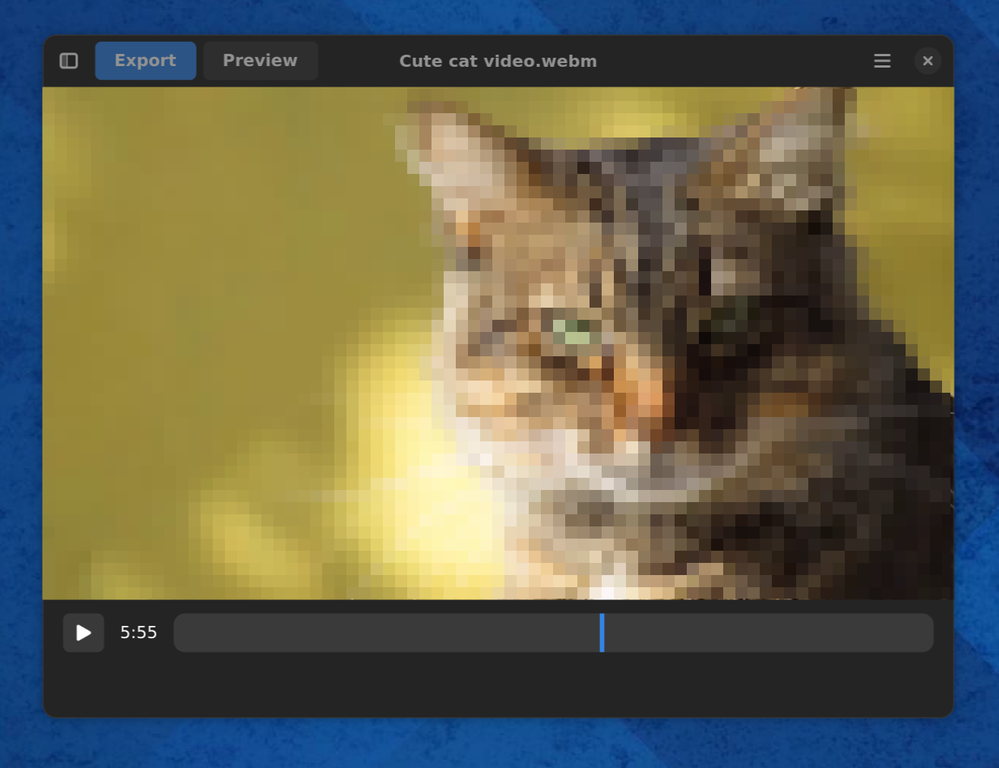
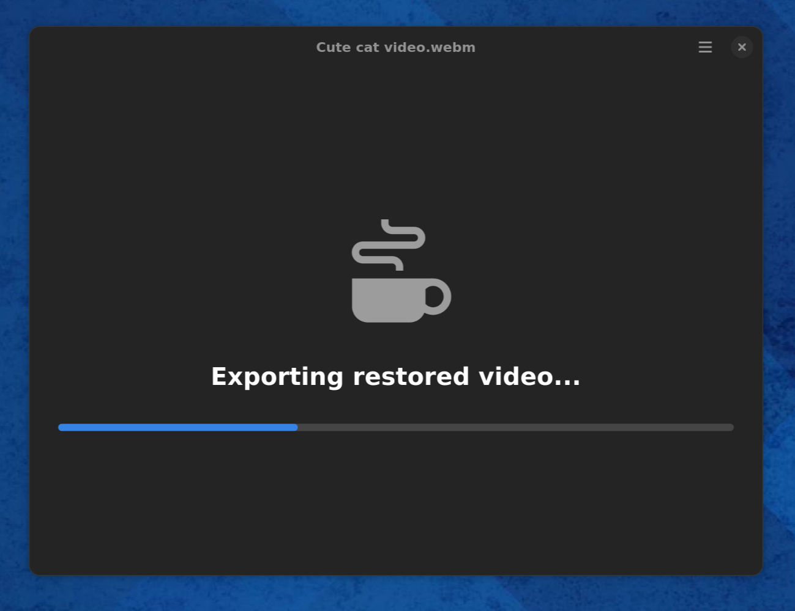

# Lada

## Features
* Removes and restored mosaic/pixelated regions of your adult videos
* Watch and convert your videos via CLI or GUI

## Use
After opening a file you can either watch a restored version of the provided video in the app (make sure you've enabled the Preview toggle) or you can export it to a new file.




You can also use the CLI to convert the video
```shell
lada-cli --input <input video path> --output <output video path>
```


## Status
Don't expect this to work perfectly, some scenes can be pretty good and close to the real thing. Others scenes will be rather meh or show worse artifacts than the original mosaics.

You'll need a (Nvidia) GPU and some patience to run the app.
If your GPU is not fast enough to watch the video in real-time you'll have to export it first and watch it later with your favorite media player.
> Note from the field: Laptop GPU Nvidia RTX 3050 is not quite fast enough for real-time playback but export works fine. RTX 3090 doesn't sweat.
> 
I've only tested it on my Linux machine. I'd expect it to work on other x86_64 Linux machines as well.

It may or may not work on Windows and Mac and other GPUs. You'll have to try to follow Developer Installation below and see how far you get.

## Models
The project comes with a `generic` model which is used by default.
There is also a `bj_pov` model which was trained only on such specific clips and shows better results than the generic model but therefore is not as versatile.
> For folks that currently use [DeepMosaics](https://github.com/HypoX64/DeepMosaics): You can also run their `clean_you_know_video model` if you prefer

You can select the model to use in the GUI by an option in the sidepanel.

## Developer Installation
The GUI/Video preview functionality uses Gstreamer (gst-plugins-base, gst-plugins-bad, gst-plugins-good, gst-plugins-rs/gst-plugin-gtk4)
For video export ffmpeg is used. You'll have to install these with you system package manager first.

You'll also need Python 3.12 (haven't tested it with other versions).

This is a Python project so let's install our dependencies from PyPy:
```bash
python -m venv .venv
source .venv/bin/activate
python -m pip install -f https://download.openmmlab.com/mmcv/dist/cu121/torch2.4/index.html -e '.[basicvsrpp,gui]'
```

These extras are enough to run the model, GUI and CLI but if you want to train the model(s) or work on the dataset(s) install additional extras `training,dataset-creation`.

The current mosaic removal modal is based on BasicVSR++ provided via MMagic. You'll have to patch some files to fix some issues not currently fixed in their released version.
```bash
patch -u ./.venv/lib/python3.12/site-packages/mmagic/__init__.py  -i patches/bump_mmagic_mmcv_dependency_bound.patch
patch -u ./.venv/lib/python3.12/site-packages/mmagic/models/editors/vico/vico_utils.py -i patches/fix_diffusers_import.patch
patch -u ./.venv/lib/python3.12/site-packages/mmengine/runner/loops.py -i patches/adjust_mmengine_resume_dataloader.patch
patch -u ./.venv/lib/python3.12/site-packages/mmagic/models/losses/perceptual_loss.py -i patches/enable_loading_vgg19_from_local_file.patch
```

If you have issues installing mmcv (dependency of MMagic) check their official docs. This can be a bit tricky as it includes custom cuda/C++ kernels so you need to install the right version for your system.

Download the models
```shell
wget -P model_weights/ 'https://github.com/ladaapp/lada/releases/download/v0.1.0/lada_mosaic_detection_model.pt'
wget -P model_weights/ 'https://github.com/ladaapp/lada/releases/download/v0.1.0/lada_mosaic_restoration_model_generic.pth'
wget -P model_weights/ 'https://github.com/ladaapp/lada/releases/download/v0.1.0/lada_mosaic_restoration_model_bj_pov.pth'
```

To train the models you'll also need those
```shell
wget -P model_weights/3rd_party/ 'https://download.openmmlab.com/mmediting/restorers/basicvsr/spynet_20210409-c6c1bd09.pth'
wget -P model_weights/3rd_party/ 'https://download.pytorch.org/models/vgg19-dcbb9e9d.pth'
wget -P model_weights/3rd_party/ 'https://github.com/QualityAssessment/DOVER/releases/download/v0.1.0/DOVER.pth'
wget -P model_weights/ 'https://github.com/ladaapp/lada/releases/download/v0.1.0/lada_nsfw_detection_model.pt'
```

Now you should be able to run the GUI via `lada` or the CLI via `lada-cli`

## Training
You can find training scripts in the root of the project and related configuration files in the `config` directory.
To train the mosaic removal model after you've created the dataset you'll have to run it in two steps.
Train a regular BasicVSR++ model without GAN first. Then convert its weights to the GAN version and continue training.
python train_basicvsrpp.py configs/basicvsr-pp_c64n15_100k_x_v2.py
python train_basicvsrpp.py configs/basicvsrpp/mosaic_restoration_generic_gan.py --load-from converted_basicvsrpp_checkpoint.pth

You can continue an interrupted run by adding '--resume' to the command line.

Training the nsfw and mosaic detection models should be straight forward. Check out the official docs of [Ultralytics](https://docs.ultralytics.com/).

## Datasets
The goal of the mosaic detection model is to detect for each frame of the video if and where pixelated/mosaic regions exist.
It will try to crop and cut small clips and hand them over to the mosaic removal model. This will try to recover what it can from those degraded frames and come up with a somewhat plausible replacement for those images.
These restored clips will replace the original content when they're reassembled with the original frames.

The mosaic detection model is a YOLO-v11, the mosaic removal model is a BasicVSR++ trained via GAN.

The data used to train these models was scraped from the web.
Afaik there are no public datasets for such purpose and I'll not provide one either. But creating a dataset for training mosaic removal models is pretty easy:
```shell
python create_mosaic_removal_video_dataset.py --input <input dir> --output-root <output dir>
```
Here `<input dir>` should be a directory containing your source material (video files without mosaics).

This script uses the nsfw detection model. It's not super accurate so you'll have to validate and remove false-positive clips manually after it ran.
You probably also want to exclude very low quality video clips by some `jq` magic to filter on the `video_quality.overall` attribute in the created metadata json files. `0.1` seems to be a good value.

The data to train the nsfw detection model was hand-labeled using [labelme](https://github.com/wkentaro/labelme).


## Contribute
The software currently is not very polished but it worked for me and maybe works for you. If you want to make it better you probably don't have to look far to find things to improve :)

## Credits (not exhaustive)
This project builds on work done by these fantastic people

[DeepMosaics](https://github.com/HypoX64/DeepMosaics):
: used their code to create mosaic for dataset creation/training, you can also run their clean_youknow_video model in this app. They seem to be the only other open source project trying to solve this task I could find. Kudos to them!

[BasicVSR++](https://ckkelvinchan.github.io/projects/BasicVSR++) / [MMagic](https://github.com/open-mmlab/mmagic)
: used as base model for mosaic removal

[YOLO/Ultralytics](https://github.com/ultralytics/ultralytics):
: used as model to detect mosaic regions as well as non-mosaic regions for dataset creation

[DOVER](https://github.com/VQAssessment/DOVER):
: used to assess video quality of created clips during the dataset creation process to filter out low quality videos

[Twitter Emoji](https://github.com/twitter/twemoji)
: used eggplan emoji as base for the app icon (feel free to contribute a better logo)


Previous iterations of the mosaic removal model used the following projects as a base

* [KAIR / rvrt](https://github.com/cszn/KAIR)

* [TecoGAN-PyTorch](https://github.com/skycrapers/TecoGAN-PyTorch)


